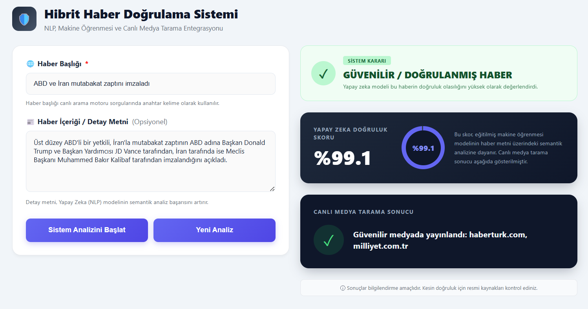
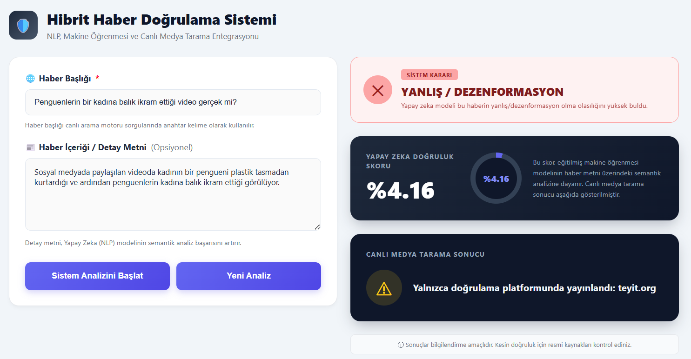
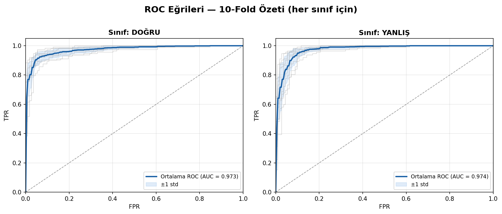
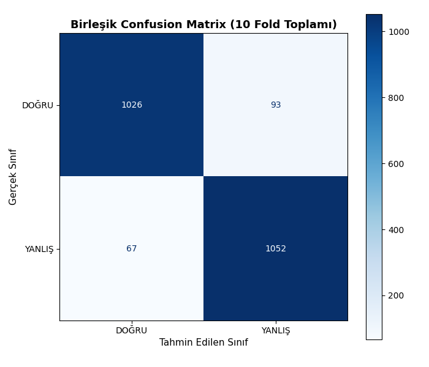

# 📰 Hybrid News Verification System


An AI-powered hybrid decision support system for detecting misinformation in Turkish news articles using **Natural Language Processing (NLP)**, **Machine Learning**, and **Live Internet Verification**.

> 🎓 Graduation Project – Bursa Technical University (2026)

---

# 🌐 Live Demo

🔗 https://hybrid-news-verification-system.onrender.com/

---

# 📌 Overview

The rapid spread of misinformation on social media and digital platforms has become a serious global problem. Manual fact-checking methods are often too slow to keep pace with the volume of online content.

This project presents a **Hybrid News Verification System** that combines **Machine Learning** with **Live Internet Verification**. Instead of relying solely on AI predictions, the system also searches trusted news sources and fact-checking platforms, providing users with comprehensive verification results.

---

# ✨ Features

- 🇹🇷 Turkish Fake News Detection
- 🧹 NLP-based Text Preprocessing
- 🧠 Word2Vec Semantic Embeddings
- 🌲 Random Forest Classification
- 🌍 Live Internet Verification via DuckDuckGo
- 📰 Trusted Domain Filtering
- ☁️ Supabase Cloud Caching
- 💻 Flask Web Application
- 📱 Responsive User Interface

---

# 📱 Example Predictions

## ✅ True News Analysis

The system analyzes the submitted news article using the trained Random Forest model and performs live verification through trusted news sources.

<p align="center">
    
</p>

---

## ❌ Fake News Analysis

Example of a misinformation article analyzed by the system. AI prediction and live verification results are presented separately to support informed decision-making.

<p align="center">
    
</p>

---

# 🏗️ System Architecture

```
                 User Input
                      │
                      ▼
           Text Preprocessing (NLP)
                      │
                      ▼
          Word2Vec Feature Extraction
                      │
                      ▼
       Random Forest Classification
                      │
         AI Prediction Score (%)
                      │
        ───────────────────────────
                      │
                      ▼
      DuckDuckGo Live Internet Search
                      │
                      ▼
 Trusted News & Fact-Checking Sources
                      │
                      ▼
        Results Presented Together
```

---

# 📊 Dataset

The dataset was manually created using web scraping from reliable Turkish news sources.

### Data Sources

- Teyit.org
- TRT Haber
- BBC News Türkçe

### Dataset Statistics

| Property | Value |
|----------|------:|
| Total News Articles | 2238 |
| True News | 1119 |
| Fake News | 1119 |
| Categories | 5 |

### Categories

- Science & Technology
- Economy
- Health
- Culture & Lifestyle
- World

The dataset is perfectly balanced (50%-50%), reducing classification bias.

---

# ⚙️ Machine Learning Pipeline

### Text Preprocessing

- Lowercase conversion
- Noise removal
- Turkish stopword removal
- Text normalization

### Feature Extraction

The textual data is converted into semantic vectors using:

- Word2Vec
- Skip-Gram architecture
- 100-dimensional embeddings

Document vectors are generated by averaging word vectors.

### Model Comparison

| Model | Accuracy |
|--------|----------|
| Logistic Regression | 88.62% |
| SVM | 89.29% |
| XGBoost | 91.29% |
| **Random Forest** | **91.52%** |

Random Forest achieved the highest performance and was selected as the final classifier.

---

# 📈 Model Performance

The final model was evaluated using **10-Fold Stratified Cross Validation**.

| Metric | Score |
|---------|-------|
| Accuracy | **92.85%** |
| F1 Score | **92.85%** |
| ROC-AUC | **97.44%** |

The model demonstrates excellent generalization capability and reliable misinformation detection.

---

# 📈 ROC Curve

The ROC curves obtained from 10-Fold Cross Validation indicate strong discrimination capability between true and fake news.

<p align="center">
    
</p>

---

# 📊 Confusion Matrix

The combined confusion matrix shows that the proposed model successfully classifies both true and fake news.

- ✅ True News Detection: **91.7%**
- ✅ Fake News Detection: **94.0%**
- ❌ False Negative Rate: **6.0%**

<p align="center">
    
</p>

---

# 🌍 Hybrid Verification Strategy

Unlike traditional fake news classifiers, this project combines AI predictions with live Internet verification.

### Artificial Intelligence Layer

- NLP preprocessing
- Word2Vec embeddings
- Random Forest prediction
- Confidence score generation

### Live Verification Layer

The application performs real-time searches using DuckDuckGo and checks whether the submitted news appears on trusted domains.

Trusted sources include:

- TRT Haber
- BBC News
- Anadolu Agency (AA)
- Teyit.org
- Doğruluk Payı

The AI prediction and live verification results are displayed independently, allowing users to make more informed decisions.

---

# ⚡ Cloud Caching

To improve efficiency and reduce unnecessary computations:

- Previous queries are stored in Supabase.
- Repeated searches return cached results instantly.
- Reduces API requests.
- Improves response time.
- Lowers computational cost.

---

# 🛠️ Technologies Used

### Backend

- Python
- Flask

### Machine Learning

- Scikit-Learn
- Gensim (Word2Vec)
- NLTK

### Database

- Supabase PostgreSQL

### Frontend

- HTML5
- CSS3

### Internet Verification

- DuckDuckGo Search

---

# 📁 Project Structure

```
Hybrid-News-Verification/
│
├── images/
│   ├── dogru_haber.png
│   ├── yanlis_haber.png
│   ├── roc_ozet.png
│   └── conf_matrix.png
│
├── app.py
├── requirements.txt
├── model/
│   ├── random_forest.pkl
│   └── word2vec.model
│
├── static/
├── templates/
├── utils/
├── dataset/
│
└── README.md
```

---

# 🚀 Installation

Clone the repository

```bash
git clone https://github.com/yourusername/Hybrid-News-Verification.git
```

Install dependencies

```bash
pip install -r requirements.txt
```

Run the application

```bash
python app.py
```

Open your browser

```
http://127.0.0.1:5000
```

---

# 🔮 Future Improvements

- BERT-based language models
- Turkish Large Language Models (LLMs)
- Image misinformation detection
- Deepfake analysis
- Explainable AI (XAI)
- Multilingual support

---

# 👩‍💻 Author

**Ümmü Gülsün Demirci**

Computer Engineering

Bursa Technical University

Graduation Project (2026)

---

# 📄 License

This repository is published for **academic and educational purposes**.
